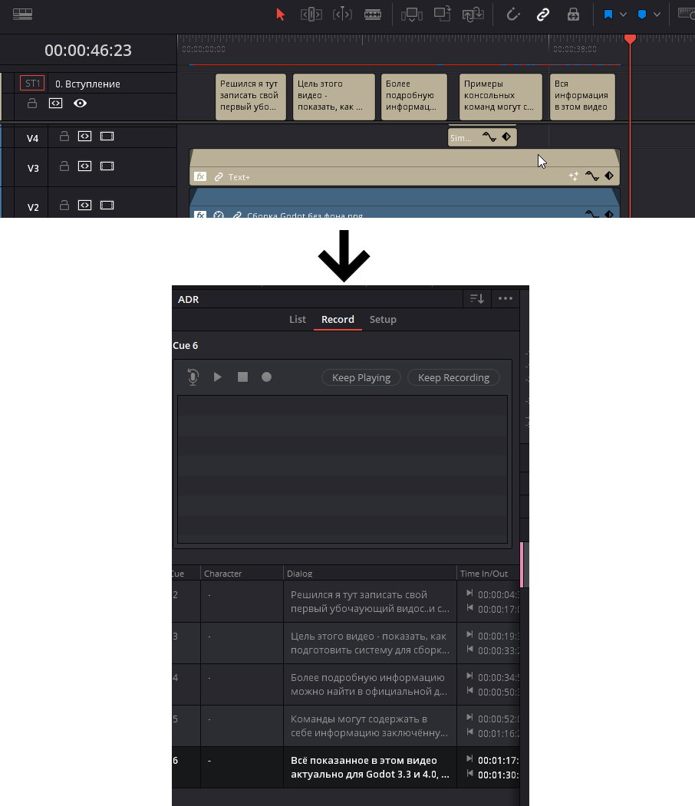

# SRT2CUElist

This is a simple converter from .srt to .csv cue list.

## Usage

The main idea is to export the subtitles from the timeline in Davinci to an srt file, convert them to csv, and import them into Davinci in the ADR section.

I don't know but maybe this is applicable to other programs.

## Support

